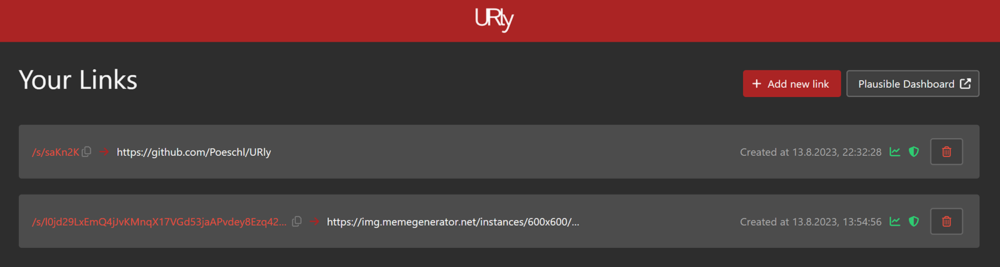

# URly

This software is a self-hosted url-shortener with a view quirks.
The registered link can be customized to be tracked, defended and maybe more.
See the features below.

## Features

* Shortens any Link to a short-code with at least 6 characters or to a long one (length of 1024 chars).
* Allows tracking of the link click via Plausible
* Defender-Mode - Forwards the user to a few "Checking link" pages. "Like a defender does"

## Setup

The preferred setup is via the provided docker-compose (`deploy` folder) file.
It will provide all necessary environment variables and the right configuration of URly.

For the backend there are some additional environment variables which needs to be set:

* `URLY_HASH_SECRET` - This can be any string and will affect the tokens we will generate.
  If not set, your short-codes can be reused on any other URly instance.
* `URLY_PLAUSIBLE_ENABLED` - Enables the tracking via Plausible.
  If this is not enabled the tracking of links will not work.
* `URLY_PLAUSIBLE_DOMAIN` - The domain which was inserted into Plausible.
* `URLY_PLAUSIBLE_API_HOST` - An custom Plausible api host, if you are not using `https://plausible.io`.
  (This should always include the protocol, like `https://mytrack.example`)

__Note: This setup has no authentication build-in! You need to take care of this by yourself__

## Note

This software will get no versioning and lives on the bloody main branch.

## Development

For development there is a little script in the project root named `start_dev_env.sh`.
Executing it as well as `.gradlew backend:bootRun` (from project root) and `npm run dev` (from the `frontend` folder)
will set up the local environment on http://localhost:8888.
